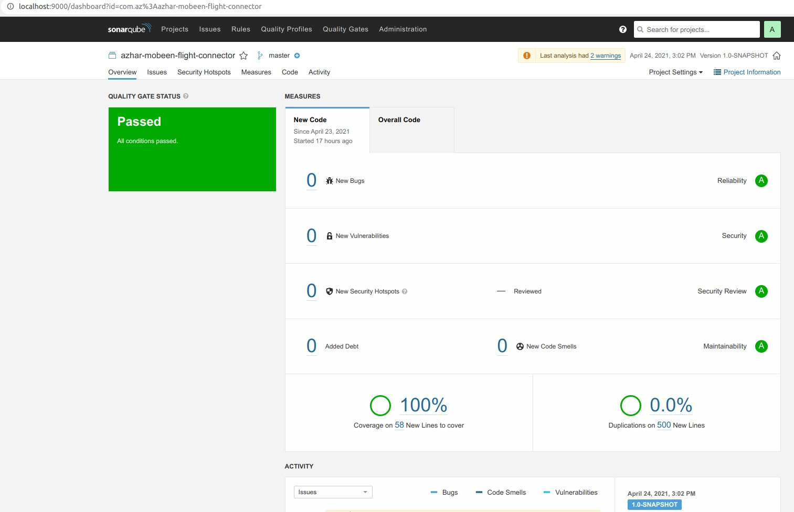

#### Az-Flight-Connector
* It's Maven multi-module project have below microservices:
    - az-master-data
    - az-flight-connector-builder
    - az-api-gateway
    - az-reactJs-app

#### How To run:
* First build project
```
./mvnw install
```
* Now run one by one
```
./mvnw spring-boot:run -pl az-flight-connector-builder
```
```
./mvnw spring-boot:run -pl az-master-data
```
```
./mvnw spring-boot:run -pl az-api-gateway
```
```
./mvnw spring-boot:run -pl az-reactJs-app
```
#### Az-ReactJs-App (Frontend)
* After running above commands, please [click here](http://localhost:8080/index.html)

#### Import all request/response
* Please import this json file in postman, it'll load all the payloads
  - [Az-Flight-Connector](Az-Flight-Connector.postman_collection.json)

#### For JaCoCo
* After building project please check below reports:
    - For az-master-data report path: az-master-data/target/site/jacoco/index.html
    - For az-flight-connector-builder report path: az-flight-connector-builder/target/site/jacoco/index.html
  
   


#### For SonarQube
* Please generate key from SonarQube server and update below command accordingly
```
./mvnw sonar:sonar -Dsonar.host.url=http://localhost:9000 -Dsonar.login=the-generated-token
```
* We can see aggregate report for all the modules


  
#### Az-ReactJs-App
